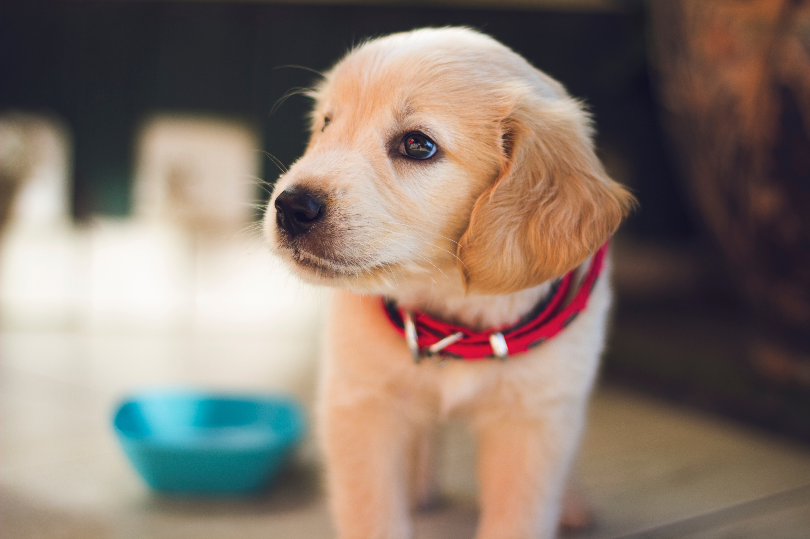

# **Facts**
### [Home](ReadMe.md)--[Projects](Projects.md)--[Facts](Page3.md)--[Cars](Page4.md) --[Code](Page5.md)

---

## Cats

The cat is a small carnivorous mammal. It is the only domesticated species in the family Felidae and often referred to as the domestic cat to distinguish it from wild members of the family. The cat is either a house cat or a farm cat, which are pets, or a feral cat, which ranges freely and avoids human contact.

---

## Mercedes

Mercedes-Benz is a German global automobile marque and a division of Daimler AG. Mercedes-Benz is known for luxury vehicles, buses, coaches, ambulances and trucks. The headquarters is in Stuttgart, Baden-Württemberg. The name first appeared in 1926 under Daimler-Benz.

---

## Dogs

The domestic dog is a member of the genus Canis, which forms part of the wolf-like canids, and is the most widely abundant terrestrial carnivore.

---

## Credits: ##

- ### Images: [*Unsplash*](https://unsplash.com/)

---
